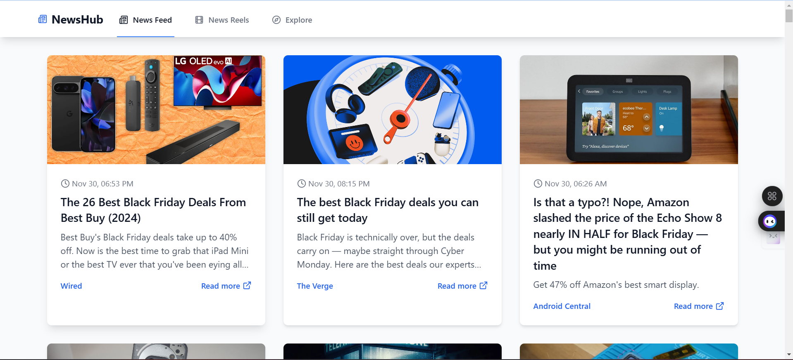
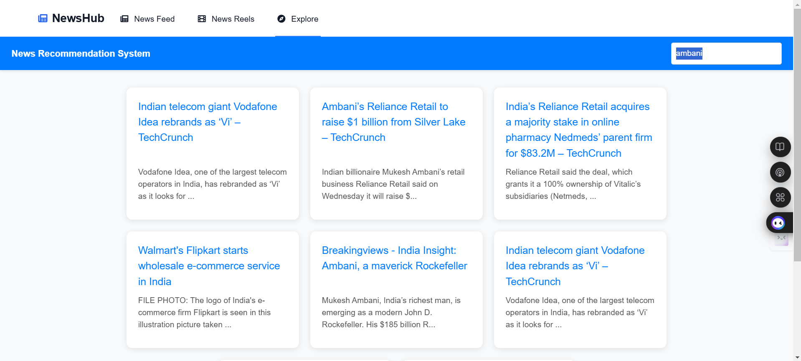

# 📰 News Article Recommendation System

This project is a **News Article Recommendation System** that fetches articles from **NewsAPI** and provides personalized article recommendations based on trending topics and user preferences. The project uses **React.js** for the frontend and **Flask** for the backend.

## Features

- Fetches news articles using the **NewsAPI**.
- Provides recommendations based on trending topics.
- User-friendly interface with options to view the articles and recommendations.
- Option to filter and search articles by categories such as **technology**, **health**, etc.

## Tech Stack

- **Frontend**: React.js, TypeScript
- **Backend**: Flask (Python)
- **API**: NewsAPI for fetching news articles

## Setup and Installation

Follow the steps below to set up and run the project on your local machine:

### Prerequisites

Ensure that you have the following installed:

- **Node.js** (for running the React app)
- **npm** (Node Package Manager)
- **Python** (for running the Flask app)
- **Flask** (for the backend)

You will also need a **NewsAPI key** to fetch articles. You can get one from [NewsAPI](https://newsapi.org/).

### Steps to Run the Project

#### Step 1: Clone the repository

```bash
git clone https://github.com/hardikkaaccount/New-Article-Recomondation-system.git
cd New-Article-Recomondation-system
```

#### Step 2: Set up the Backend (Flask)

1. Run the Flask server:

- navigate to "flask-app\RecomondationSystemPy.ipynb" and run the notebook till end.
- untill pickle export all 3 files

2. Navigate to the `flask-app` directory:

```bash
cd flask-app
```

3. Run the Flask server:

```bash
python app.py
```

The Flask server will be running and listening for requests.

#### Step 3: Set up the Frontend (React)

1. Navigate to the `react-app` directory:

```bash
cd react-app
```

2. Open `src/App.tsx` in your code editor and replace the **NewsAPI key** with your own:

```typescript
const API_Key = "YOUR_NEWS_API_KEY"; // Your News API key (visit "https://newsapi.org/" for key)
```

3. Install the required dependencies:

```bash
npm install
```

4. Start the React development server:

```bash
npm run dev
```

The frontend will run at `http://localhost:5173/`.

### Running the App

Once both the **Flask backend** and **React frontend** are running, you can access the application by navigating to:

```
http://localhost:5173/
```

This will open the **News Article Recommendation System** in your browser.

## Screenshots

Here are some screenshots of the application:


*Homepage displaying trending articles.*



*Personalized recommendations based on user preferences.*

## Acknowledgements

- Special thanks to [NewsAPI](https://newsapi.org/) for providing the news articles.
- Developed during the skill development internship at **PES College of Engineering, Mandya**.

## 📞 Contact Us  

We would love to hear from you! Feel free to reach out to us for collaborations, queries, or just to connect. Below are our contact details:

<table style="width: 100%; text-align: center; border-collapse: collapse;">

  <tr>
    <td>
      <a href="https://github.com/hardikkaaccount" target="_blank">
        
      </a>
    </td>
    <td>
      <a href="https://github.com/Vikasrp24" target="_blank">
        
      </a>
    </td>
        <td>
      <a href="https://gitHub.com/Srinidhiprabhumu" target="_blank">
        
      </a>
    </td>
        <td>
      <a href="https://github.com/SennaGtr28" target="_blank">
        
      </a>
    </td>
  </tr>
  
  <tr>
    <td>
      <a href="https://www.linkedin.com/in/hardikjain108/" target="_blank" style="text-decoration: none; color: black; font-weight: bold;">
        Hardik Jain
      </a>
    </td>
    <td>
      <a href="https://www.linkedin.com/in/rpvikas" target="_blank" style="text-decoration: none; color: black; font-weight: bold;">
        Vikas RP
      </a>
    </td>
    <td>
      <a href="https://www.linkedin.com/in/srinidhi0512/" target="_blank" style="text-decoration: none; color: black; font-weight: bold;">
        Srinidhi <br> Prabhu MU
      </a>
    </td>
    <td>
      <a href="https://www.linkedin.com/in/niranjan28c/" target="_blank" style="text-decoration: none; color: black; font-weight: bold;">
        Niranjan C
      </a>
    </td>
  </tr>

</table>


<p style="text-align: center; font-style: italic; margin-top: 20px;">Looking forward to connecting with you!</p>
